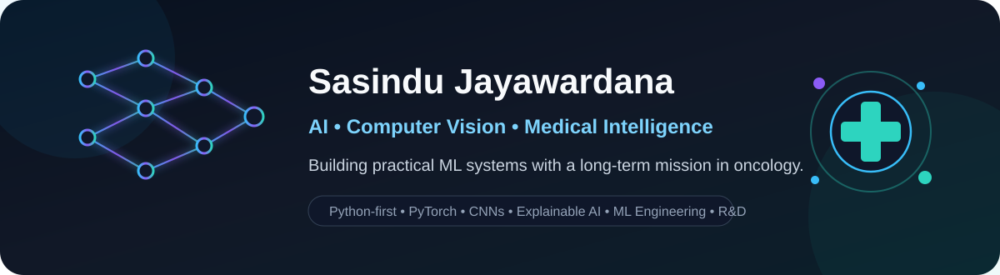

<p align="center">
  
</p>

<h1 align="center">Hi, I'm Sasindu Jayawardana 👋</h1>

<p align="center">
  Software Engineering undergraduate • AI / ML builder • Computer Vision enthusiast • Future R&D engineer
</p>

<p align="center">
  <a href="https://github.com/SasiKaw">
    
  </a>
  
  
  
</p>

---

## 👨‍💻 About Me

I'm a **Software Engineering undergraduate from Sri Lanka** building toward a career in **AI engineering and research & development**.

My strongest interests are where **software engineering, machine learning, computer vision and healthcare** meet. I especially enjoy learning by building: training models, debugging real systems, exploring model behavior and turning experiments into usable software.

My long-term ambition is much bigger than simply becoming an AI engineer: I want to contribute to technologies that improve **cancer research, diagnosis and treatment**, and eventually help build a dedicated cancer research initiative of my own.

I'm also preparing for a future **R&D engineering career in Japan**, while continuously strengthening my Python, ML engineering and production software skills.

---

## 🧠 What I'm Interested In

<table>
<tr>
<td width="50%" valign="top">

### AI & Machine Learning
- Computer Vision
- Convolutional Neural Networks
- Deep Learning with PyTorch
- Medical Image Classification
- Explainable / Interpretable AI
- ML Engineering
- Model evaluation and debugging
- MLOps and deployment
- Generative AI, RAG and AI agents

</td>
<td width="50%" valign="top">

### Bigger Questions I Care About
- How can AI support cancer research?
- How do we make medical AI more trustworthy?
- What makes a model fail outside its training data?
- How can biological systems inspire machine intelligence?
- How do we turn experiments into reliable software?
- How can research move from notebooks into real-world tools?

</td>
</tr>
</table>

---

## 🩺 AI + Healthcare Projects

### 🔬 Breast Cancer Classification AI
An end-to-end deep learning project for classifying histopathology images, with work spanning **model training, Streamlit UI, deployment and debugging**.

➡️ [View project](https://github.com/SasiKaw/breast-cancer-classification-ai)

### 🧬 Skin Cancer AI Interpretability
A PyTorch project exploring **CNN-based skin lesion classification** together with **saliency maps and interpretability**, focusing on what the model is actually looking at.

➡️ [View project](https://github.com/SasiKaw/Skin-Cancer-AI-Interpretability)

### 🧪 Ovarian Cancer Subtype Classification
A FastAI-based medical imaging experiment exploring **ovarian cancer subtype classification**.

➡️ [View project](https://github.com/SasiKaw/Ovarian-Cancer-Subtype-Classification-with-FastAI)

> These projects are part of my learning journey in medical AI and are intended for research / educational exploration rather than clinical use.

---

## 🚀 What I'm Building Right Now

### ML Engineering Journey
I'm documenting a structured path from ML foundations toward production-oriented AI systems.

Current focus:
- Python engineering foundations
- Testing with pytest
- Git / GitHub workflows
- PyTorch and deep learning
- APIs and deployment
- MLOps fundamentals
- Evaluated LLM / RAG / agent systems
- Building stronger technical and interview evidence

➡️ [Follow the journey](https://github.com/SasiKaw/ml-engineering-journey)

---

## 🧩 Software Engineering Work I've Already Done

Before focusing heavily on AI, I built software across multiple stacks and university projects, including:

- **Exam Management System** — Django, Python, MySQL, JavaScript and Tailwind CSS
- **Event Management System** — C# / .NET collaborative project
- **Learning Management System**
- **Admin Panel**
- **Weather App**
- **Data Structures & Algorithms practice**
- Full-stack and team-based university software projects

This background matters to me because I don't want to only train models — I want to become the kind of AI engineer who can **build, test, debug, deploy and maintain complete systems**.

---

## 🛠️ Tech Stack

### Main / Current Focus

<p>
  
</p>

### Software Engineering Background

<p>
  
</p>

### Currently Growing Into

<p>
  
  
  
  
  
</p>

---

## 🧭 Career Direction

```text
Software Engineering
        ↓
Machine Learning
        ↓
Computer Vision + Deep Learning
        ↓
ML Engineering + R&D
        ↓
Medical AI / Oncology Research
        ↓
Build technology that meaningfully contributes to cancer research
```

I'm aiming for **Associate / Junior AI Engineer and applied ML roles** first, while building the engineering depth needed for long-term **R&D and medical AI work**.

---

## 🌱 Beyond Code

- 🇯🇵 Learning Japanese and working toward stronger professional proficiency
- 🧠 Curious about neuroscience, biological intelligence and brain-inspired AI
- 🔍 Interested in digital forensics and technical investigation
- 📚 I prefer learning by building real projects rather than only consuming theory
- 🧪 Long-term: medical AI, oncology research and research-driven product development

---

## 📊 GitHub

<p align="center">
  
  
</p>

<p align="center">
  
</p>

---

## 🤝 Connect

<p>
  <a href="https://www.linkedin.com/in/sasindu-jayawardana-0a6270212">
    
  </a>
  <a href="https://github.com/SasiKaw">
    
  </a>
</p>

---

<p align="center">
  <b>“Build the engineering depth first. Use it later where it matters most.”</b>
</p>
